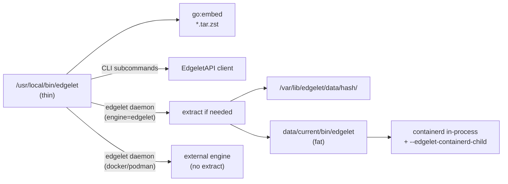
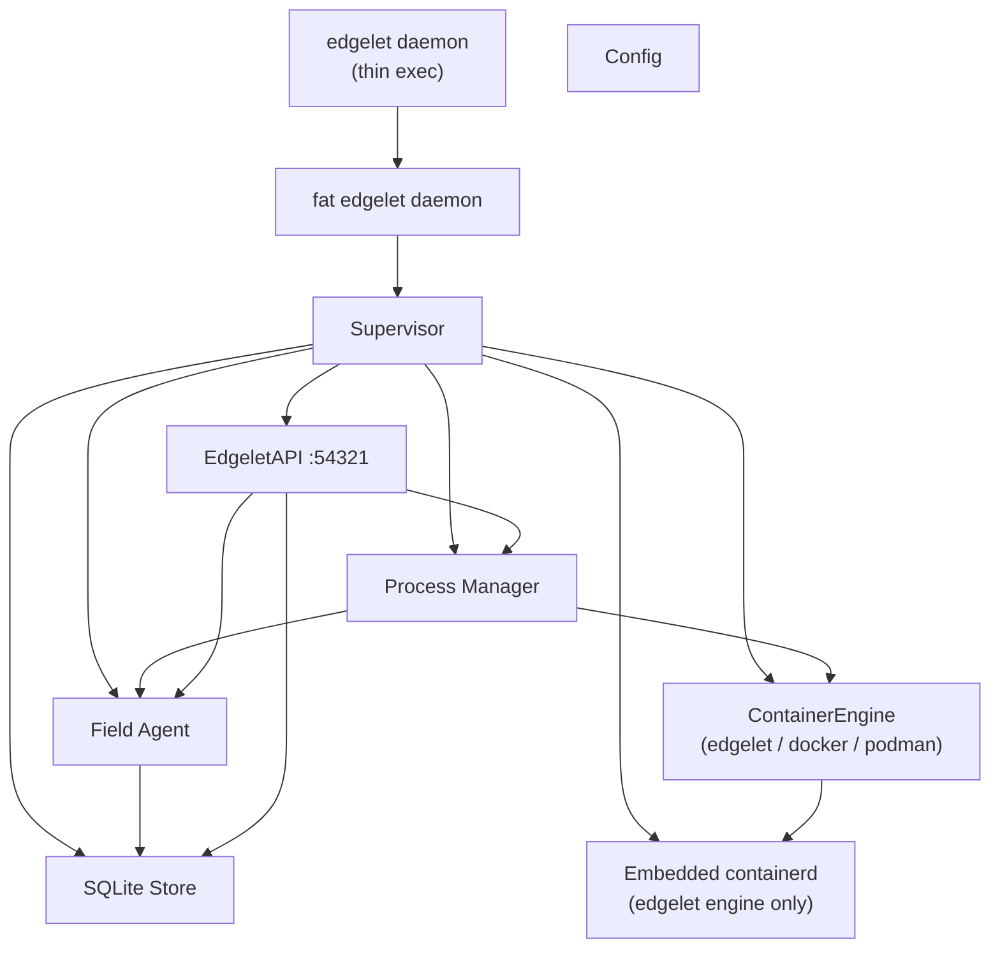
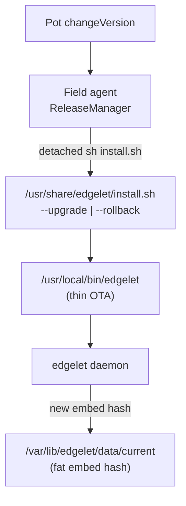
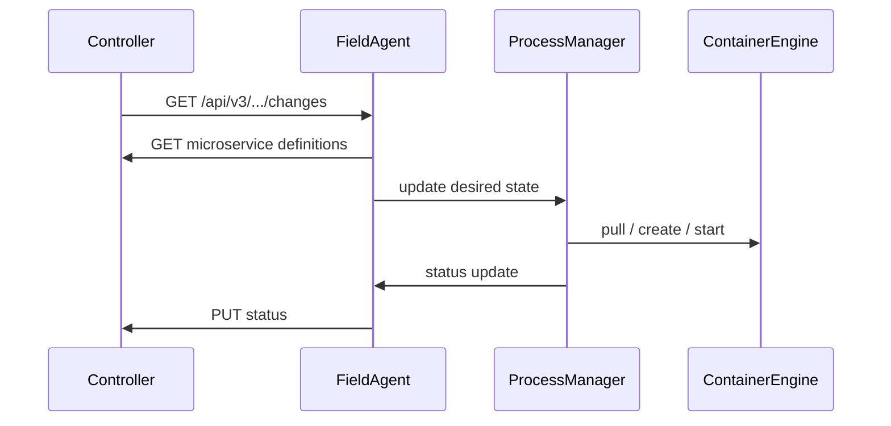

# Edgelet architecture

## Overview

Edgelet is the edge agent for the ioFog platform. On **linux**, production ships a **two-layer**:

| Layer | Path | Role |
|-------|------|------|
| **Thin** | `/usr/local/bin/edgelet` | Download/OTA binary (`CGO=0`): `go:embed` zstd bundle, extract orchestration, **all operator CLI** (EdgeletAPI client), `version` / help |
| **Fat** | `/var/lib/edgelet/data/current/bin/edgelet` | Runtime ELF (`CGO=1`): supervisor, field agent, process manager, EdgeletAPI server, in-process containerd; `--edgelet-containerd-child` |

`edgelet daemon` (including systemd) starts at the **thin** entry. When `containerEngine: edgelet`, the thin process lazy-extracts the embedded bundle, then `exec`s the **fat** binary with the same arguments. Operator commands (`edgelet ms …`, `edgelet deploy …`, etc.) run **in the thin process** and do not require extract.

On **darwin** and **windows**, Edgelet is a **single monolithic** ELF: CLI + daemon, no embed, no two-layer split. Only `docker` or `podman` engines are supported on desktop.

The supervisor maintains bidirectional sync with the ioFog Controller, reconciles desired microservice state against a pluggable container engine, and exposes the on-device **EdgeletAPI** for local administration.

All container operations go through a `ContainerEngine` interface (`edgelet`, `docker`, or `podman`). On linux, all three engines are linked into one binary; selection is **runtime** via `containerEngine` in config. On desktop, only docker/podman are allowed.

---

## Linux — thin vs fat dispatch



**Lazy extract:** On first `edgelet daemon` with `containerEngine: edgelet` after the thin binary is replaced (upgrade), the new embed hash unpacks to `/var/lib/edgelet/data/<hash>/`, verifies `bin/edgelet` (fat) and auxiliaries, then rotates `data/current` and `data/previous` symlinks. After a successful extract, hash directories other than `current`, `previous`, and the running fat binary’s tree are removed.

**External engines:** When `containerEngine` is `docker` or `podman`, the thin daemon does **not** extract the bundle; it connects to the host engine socket with boot-time retries.

**Break-glass:** Operators may invoke the fat runtime directly, e.g. `/var/lib/edgelet/data/current/bin/edgelet daemon`, bypassing thin dispatch (useful for debugging; normal production path remains thin).

---

## Directory layout

```
.
├── cmd/edgelet/              # Thin entry (linux): CLI + embed + daemon dispatch
│                             # Monolithic entry (darwin/windows): CLI + daemon
├── cmd/edgelet-server/       # Fat entry (linux only): daemon + containerd child — not in PATH
├── internal/
│   ├── auth/                 # JWT, TLS, EdgeletAPI PKI and token lifecycle
│   ├── buildmeta/            # Platform capability (HasEmbeddedEngine, AllowedEngines)
│   ├── config/               # YAML config load/save, SIGHUP reload
│   ├── edgeletapi/           # EdgeletAPI HTTP/WebSocket server (:54321)
│   ├── fieldagent/           # Controller communication and sync
│   ├── modelmanager/         # Model artifact reconcile, async pull, prune
│   ├── modelpull/            # OCI + Hugging Face adapters and on-disk store
│   ├── processmanager/       # Container reconciliation loop
│   ├── statusreporter/       # Status aggregation
│   ├── store/                # SQLite persistence
│   ├── supervisor/           # Root orchestrator — module start/stop order
│   └── volumemount/          # Secret / ConfigMap volume lifecycle
└── pkg/
    ├── containerd/           # In-process containerd service (edgelet engine)
    └── engine/
        ├── engine.go         # ContainerEngine interface
        ├── docker/           # Docker adapter (linux + desktop)
        ├── podman/           # Podman adapter (linux + desktop)
        └── edgelet/          # Embedded containerd adapter (linux only)
```

---

## Module diagram



Module startup order and Tier 1 deep dives: [modules/README.md](modules/README.md).

---

## EdgeletAPI

The **EdgeletAPI** is the daemon↔CLI HTTPS/WebSocket surface on the edge node. It is **not** the Controller REST API.

| Item | Value |
|------|--------|
| Port | `54321` (TLS) |
| Route prefix | `/v1/...` |
| CLI bearer token | `/etc/edgelet/edgelet-api` |
| TLS trust | `/etc/edgelet/edgeletapi-ca.crt` |
| Unix socket (CLI) | `/run/edgelet/edgelet.sock` |
| JWT `tokenUse` | `edgeletapi` |
| JWT `aud` | `edgelet://edgeletapi/v1` |

Route groups include `/v1/system/*`, `/v1/ms/*`, `/v1/deploy/*`, `/v1/auth/*`, and `/v1/images/*`. Full contract: [edgelet-api-v1-openapi.yaml](edgelet-api-v1-openapi.yaml). Operator guide: [edgelet-api-v1.md](edgelet-api-v1.md). Per-module runtime docs: [modules/README.md](modules/README.md).

---

## Controller API

The **Field Agent** talks to the remote ioFog Controller over HTTPS. Controller REST paths remain under `/api/v3/...` (Pot-compatible). This is separate from EdgeletAPI `/v1/...` on localhost.

The field agent polls for configuration changes, loads microservices, registries, volume mounts, models, and RuntimeClasses into SQLite, and posts aggregated status back to the controller. Host hardware/USB inventory posting has been removed.

---

## Container engines (by platform)

| Platform | Allowed `containerEngine` | Default | Binary layout |
|----------|---------------------------|---------|---------------|
| **linux** | `edgelet`, `docker`, `podman` | `edgelet` | Thin + fat-in-tar when using `edgelet`; monolithic dispatch path for docker/podman |
| **darwin / windows** | `docker`, `podman` | `docker` | Monolithic |

See [container-engine.md](container-engine.md) for paths, CNI, and RuntimeClass shims.

---

## DNS (embedded engine)

Linux deployments with `containerEngine: edgelet` run an embedded authoritative DNS subsystem on the bridge gateway for `svc.bridge.local` service discovery. See [dns.md](dns.md).

Agent DNS name: `edgelet.default.svc.bridge.local`.

---

## Persistence

| Path | Purpose |
|------|---------|
| `/etc/edgelet/config.yaml` | Active configuration |
| `/etc/edgelet/edgelet-api` | EdgeletAPI CLI bearer token (auto-created) |
| `/etc/edgelet/edgeletapi-*.crt/key` | EdgeletAPI TLS PKI |
| `/var/lib/edgelet/` | User data, volume mounts, SQLite, persistent `VOLUME` trees (`volumes/data/`, `volumes/shared/`) |
| `/var/lib/edgelet/data/<hash>/` | Extracted zstd bundle (fat `bin/edgelet`, shim, crun, CNI, pause image). Only `current` and `previous` trees are kept after a successful extract |
| `/var/lib/edgelet/data/current` | Symlink → active `<hash>/` directory |
| `/var/lib/edgelet/data/previous` | Symlink → prior bundle (rollback reference) |
| `/var/lib/edgelet-containerd/` | Containerd state (edgelet engine) |
| `/var/run/edgelet/` | Runtime sockets and PID files |
| `/var/log/edgelet/` | Rotated daemon logs |

SQLite stores cached microservices, registries, volume mount records, and the persistent-volume ledger. Schema migrations run idempotently on startup (current schema version **3**).

---

## Release OTA (two layers)

Fleet upgrades use **two coordinated layers**. See [installation.md](installation.md).



| Layer | Owner | Metadata |
|-------|--------|----------|
| **Thin binary** | `install.sh` | `/var/backups/edgelet/install-receipt`, `previous-release`, `cache/` |
| **Fat bundle** | Daemon extract | `data/current`, `data/previous` symlinks |

Controller heartbeat exposes `readyToUpgrade` / `readyToRollback` when the install script and receipt state allow OTA. Container deployments (`EDGELET_DAEMON=container`) use image-tag rollout only.

---

## Key data flow — microservice deploy


