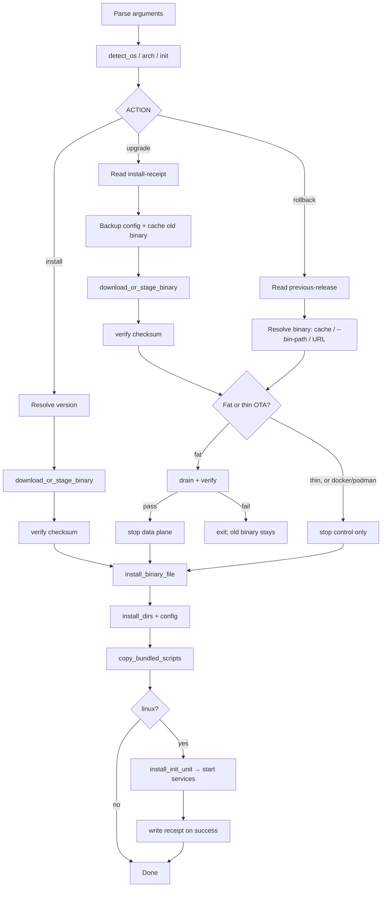
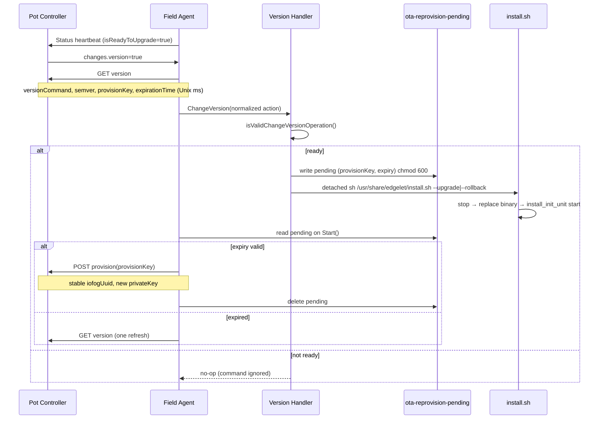

# Edgelet installation and upgrade

Install Edgelet on **linux**, **darwin**, and **windows** using **`install.sh`**. Releases ship **raw binaries only** (no `.tar.gz` install bundles, no DEB/RPM).

For production topology (systemd layout, engine selection, provisioning workflow), see [deployment.md](deployment.md).

---

## Overview

| Platform | Install artifact | Default `containerEngine` | OTA via `install.sh` |
|----------|------------------|---------------------------|----------------------|
| **linux** | Thin wrapper + zstd-embedded fat runtime | `edgelet` | Yes (native + controller-driven) |
| **darwin** | Monolithic binary | `docker` | Manual binary replace only |
| **windows** | Monolithic `.exe` | `docker` | Not supported by version handler |

Fleet upgrades on linux use **two layers**:

| Layer | Mechanism | On-disk state |
|-------|-----------|---------------|
| **1 — Thin binary** | `install.sh --upgrade` / `--rollback` | `/var/backups/edgelet/` receipts and cache |
| **2 — Fat embed** | `edgelet daemon` extract on new embed hash | `/var/lib/edgelet/data/current`, `data/previous` |

See [architecture.md](architecture.md#release-ota-two-layers) for the architecture diagram.

**Forbidden upgrade paths:** `iofog-agentvc.jar`, apt/dnf/yum edgelet packages, or any path that bypasses `install.sh` on linux native installs.

---

## Prerequisites

| Platform | Requirements |
|----------|--------------|
| **linux** | Root/sudo; Ubuntu 20.04+, RHEL 8+, Debian 11+ (or equivalent); network for online install |
| **darwin** | Admin for `/usr/local/bin`; Docker or Podman when not using linux embedded engine |
| **windows** | Admin; Docker or Podman |
| **`containerEngine: edgelet` (linux)** | No external container runtime on the host |
| **`docker` / `podman`** | Docker 26.10+ or Podman 3.0+ |

Linux init detection (auto): **systemd**, **procd** (OpenWrt), OpenRC, SysV, upstart, s6, runit. Templates live under `packaging/init/`.

---

## Release artifacts

Per tag on GitHub **`eclipse-iofog/edgelet`** (override with `EDGELET_GITHUB_REPO`):

**Datasance distribution mirror:** [Datasance/edgelet](https://github.com/Datasance/edgelet) publishes the same tags and artifacts. Release `install.sh` is stamped with the publisher repo; override with `EDGELET_GITHUB_REPO` if needed.

| Channel | Download URL pattern |
|---------|----------------------|
| Eclipse | `https://github.com/eclipse-iofog/edgelet/releases/download/<tag>/edgelet-<os>-<arch>[.exe]` |
| Datasance | `https://github.com/Datasance/edgelet/releases/download/<tag>/edgelet-<os>-<arch>[.exe]` |

| OS / arch | Binary file |
|-----------|-------------|
| linux amd64 / arm64 / arm / riscv64 | `edgelet-linux-<arch>` |
| darwin amd64 / arm64 | `edgelet-darwin-<arch>` |
| windows amd64 | `edgelet-windows-amd64.exe` |

Also published: `SHA256SUMS`, `edgelet-config.yaml.sample`, `edgelet-controller-ca.crt.sample`, `install.sh`, `uninstall.sh`.

Download URL pattern:

```text
https://github.com/eclipse-iofog/edgelet/releases/download/<tag>/edgelet-<os>-<arch>[.exe]
```

Build locally: `make release-binaries VERSION=v1.0.0` → `dist/`.

The fat runtime inside the linux zstd embed is **statically linked by default** (`STATIC_BUILD=true`), so one artifact runs on glibc and musl (Alpine, OpenWrt). CI runs `scripts/check-embed-static.sh` after packaging.

---

## Install paths

| Purpose | Linux | macOS | Windows |
|---------|-------|-------|---------|
| Binary | `/usr/local/bin/edgelet` | `/usr/local/bin/edgelet` | `%ProgramFiles%\Edgelet\edgelet.exe` |
| Config | `/etc/edgelet/config.yaml` | `/etc/edgelet/config.yaml` | `%ProgramData%\Edgelet\config\config.yaml` |
| Controller CA | `/etc/edgelet/cert.crt` | same | same |
| Data | `/var/lib/edgelet/` | `/var/lib/edgelet/` | `%ProgramData%\Edgelet\data\` |
| Runtime | `/run/edgelet/` | `/var/run/edgelet/` | `%ProgramData%\Edgelet\run\` |
| Logs | `/var/log/edgelet/` | `/var/log/edgelet/` | `%ProgramData%\Edgelet\log\` |
| Scripts | `/usr/share/edgelet/` | `/usr/local/share/edgelet/` | `%ProgramData%\Edgelet\scripts\` |
| OTA metadata | `/var/backups/edgelet/` | — | — |

Linux thin runtime chain: `/usr/local/bin/edgelet` → lazy extract → `/var/lib/edgelet/data/current/bin/edgelet` (fat).

---

## Fresh installation

### Online (linux)

```bash
curl -fsSL https://github.com/eclipse-iofog/edgelet/releases/download/vX.Y.Z/install.sh -o install.sh
chmod +x install.sh
sudo ./install.sh --version=vX.Y.Z
```

When `--version` is omitted or set to `latest`, the script resolves the tag from GitHub `releases/latest` before downloading the binary.

### Online (Datasance mirror)

Same flow; `install.sh` from the Datasance release defaults to `datasance/edgelet`:

```bash
curl -fsSL https://github.com/Datasance/edgelet/releases/download/vX.Y.Z/install.sh -o install.sh
chmod +x install.sh
sudo ./install.sh --version=vX.Y.Z
```

### From a clone (dev / CI)

```bash
sudo ./install.sh --bin-path=build/edgelet-linux-amd64 --version=dev
```

### Airgap

On a connected machine, download the binary and verify against `SHA256SUMS`, then copy to the edge host:

```bash
sudo ./install.sh \
  --airgap \
  --bin-path=/tmp/edgelet-linux-arm64 \
  --expected-sha256=<sha256-from-SHA256SUMS> \
  --version=v1.2.3
```

Alternatively use `--checksum-path=SHA256SUMS` with the manifest in the same directory as the binary.

### First-time configuration

If `/etc/edgelet/config.yaml` is missing, `install.sh` installs a sample from packaging or `/usr/share/edgelet/edgelet-config.yaml.sample`. You can also run:

```bash
sudo edgelet init-config
```

`init-config` is idempotent and does **not** overwrite an existing file.

Controller CA (`/etc/edgelet/cert.crt`) is **not** installed by default. For lab installs use `--with-sample-ca`; for production use **`edgelet provision`** or `edgelet config cert`.

### Install flags

| Flag | Purpose |
|------|---------|
| `--version=` | Release tag (default `latest` when downloading) |
| `--arch=` | Override auto-detected arch (`amd64`, `arm64`, `arm`, `riscv64`) |
| `--bin-path=` | Local binary (dev, airgap, CI) |
| `--airgap` | Offline; requires `--bin-path` |
| `--expected-sha256=` | Verify local binary SHA256 |
| `--checksum-path=` | `SHA256SUMS` file for verification |
| `--upgrade` / `--rollback` | In-place thin-binary OTA |
| `--force-config` | Replace config from sample (destructive) |
| `--with-sample-ca` | Copy sample controller CA if `cert.crt` missing |
| `--container-engine=` | `edgelet`, `docker`, or `podman` (linux default: **edgelet**) |

Environment: `EDGELET_VERSION`, `EDGELET_GITHUB_REPO`.

### After install

`install.sh` does **not** provision the node. On **linux** it installs the init unit and **starts** `edgelet.service` (and `edgelet-containerd` when `containerEngine=edgelet`). On **darwin** and **windows** it starts `edgelet daemon` in the background (`nohup`); logs go to `edgelet.0.log` under the platform log directory.

```bash
edgelet --version
edgelet system status
edgelet config --a <controller-api-endpoint>
edgelet provision <provisioning-key>
```

Orchestrators (`potctl`, `iofogctl`) must **not** pass provision keys to `install.sh`. See [deployment.md](deployment.md#potctl--iofogctl-contract).

---

## `install.sh` execution flow

The script sources `scripts/lib/init-detect.sh` and `init-edgelet.sh`, then branches on `--upgrade`, `--rollback`, or fresh install.



Fresh install writes the receipt before the first start. Upgrade and rollback write it after services start, and only after drain has verified when a data-plane restart was required.

### Phase 1 — Bootstrap

Constants set at the top of `install.sh`:

| Path | Role |
|------|------|
| `/var/backups/edgelet/` | `BACKUP_DIR` |
| `/var/backups/edgelet/cache/` | Cached previous binaries |
| `/var/backups/edgelet/install-receipt` | Current install metadata |
| `/var/backups/edgelet/previous-release` | Rollback metadata |
| `/usr/share/edgelet/` (linux) | Bundled `install.sh`, `uninstall.sh`, config/CA samples |
| `/usr/local/share/edgelet/` (macOS) | Bundled `install.sh`, `uninstall.sh`, config/CA samples |
| `%ProgramData%\Edgelet\scripts\` (windows) | Bundled `install.sh`, `uninstall.sh`, config/CA samples |

### Phase 2 — Fresh install

1. `download_or_stage_binary` — GitHub release URL or `--bin-path`
2. `install_dirs` — config, log, data, backup, share directories
3. `install_binary_file` → `/usr/local/bin/edgelet` (or platform path)
4. `install_config_samples` — preserve existing config unless `--force-config`
5. `apply_container_engine_to_config` — patch `containerEngine` in config when flag set
6. `write_install_receipt` — `install_method=install` or `install-airgap`
7. `copy_bundled_scripts` — copy `install.sh` and `uninstall.sh` to the platform scripts directory
8. `install_init_unit` — install systemd/OpenRC/… unit and **start** the daemon

### Phase 3 — Upgrade (`--upgrade`)

Requires an existing binary and `install-receipt`. Control and the data plane stay up until the staged binary is checksum-verified. Fat and thin upgrades then diverge — see [Fat OTA and thin OTA](#fat-ota-and-thin-ota).

1. Read current receipt (`installed_version`, `os`, `arch`, `container_engine`, `source_url`, `binary_sha256`)
2. Resolve target version (`--version=` or GitHub `latest`)
3. Copy `/etc/edgelet/config.yaml` to `/var/backups/edgelet/config.yaml.<timestamp>`
4. `cache_binary` — copy current thin binary to `cache/edgelet-<ver>-<os>-<arch>`
5. Download or stage the new binary and verify its checksum
6. Replace the binary:
   - **Fat OTA** (`containerEngine=edgelet`, and the ready embed hash is missing or different): drain and verify while control is still up. Verify failure exits non-zero and leaves the installed binary in place. Verify success stops the data plane, then installs the new thin binary.
   - **Thin OTA** (ready `data/current` matches the new embed hash), and **docker / podman**: stop the control service only. The data plane is not stopped.
7. `write_previous_release` — record rollback metadata including `config_backup_path`
8. Refresh directories, config, and bundled scripts
9. `install_init_unit` — start control; when a data-plane restart was required, start `edgelet-containerd` first
10. Write the install receipt only after that success (`install_method=upgrade` or `upgrade-airgap`)

```bash
sudo sh /usr/share/edgelet/install.sh --upgrade --version=v1.2.3
sudo sh /usr/share/edgelet/install.sh --upgrade   # target = GitHub latest
```

### Phase 4 — Rollback (`--rollback`)

Requires `previous-release` from the last successful upgrade.

1. Read `previous_version`, `previous_os`, `previous_arch`, `previous_download_url`, `config_backup_path`
2. Prefer cached binary at `cache/edgelet-<previous_version>-<os>-<arch>`
3. Else `--bin-path` (with optional `--airgap`), else download from `previous_download_url`
4. Same fat vs thin replace as upgrade: drain and verify before a data-plane stop when the embed hash requires it; otherwise stop control only
5. Restore config from `config_backup_path` unless `--force-config`
6. `install_init_unit` — start services (data plane first when a restart was required)
7. `write_install_receipt` with `install_method=rollback` after that success

```bash
sudo sh /usr/share/edgelet/install.sh --rollback
```

---

## OTA on-disk state

### `install-receipt`

Written after every successful install, upgrade, or rollback (`chmod 600`). On an upgrade or rollback that must restart the data plane, the receipt is written only after drain verified, the new thin binary is installed, and services have been started. A failed verify does not update the receipt.

```text
installed_version=v1.2.3
os=linux
arch=arm64
container_engine=edgelet
source_url=https://github.com/eclipse-iofog/edgelet/releases/download/v1.2.3/edgelet-linux-arm64
installed_at=2026-06-06T12:00:00Z
install_method=upgrade
binary_sha256=<sha256>
```

`ReleaseManager.GetInstalledVersion()` reads `installed_version` from this file; if missing, it falls back to the running build version from `edgelet --version`.

### `previous-release`

Written on **upgrade** after the thin binary is replaced (a failed drain never reaches this step):

```text
previous_version=v1.2.2
previous_os=linux
previous_arch=arm64
previous_container_engine=edgelet
previous_download_url=https://github.com/.../edgelet-linux-arm64
previous_binary_sha256=<sha256>
config_backup_path=/var/backups/edgelet/config.yaml.20260606115900
```

### Binary cache

```text
/var/backups/edgelet/cache/edgelet-<version>-<os>-<arch>
```

Rollback uses the cache first; the version handler treats cache **or** a reachable `previous_download_url` (HTTP HEAD or `file://`) as sufficient for `readyToRollback`.

---

## Layer 2 — Fat embed (daemon)

After a fat upgrade, the next data-plane start:

1. Extracts to `/var/lib/edgelet/data/<new-hash>/`
2. Rotates `data/current` and `data/previous` symlinks
3. Removes other `data/<hash>/` trees (and leftover `<hash>-tmp` dirs). `current` and `previous` are kept so coordinated rollback can reuse the prior unpack.

Operator CLI (`edgelet ms`, `edgelet deploy`, …) runs in the **thin** process and does not trigger extract.

### Fat OTA and thin OTA

`install.sh` compares the new binary’s embed hash (`edgelet version --verbose`, line `embed hash:`) with the **ready** install under `/var/lib/edgelet/data/current`. Ready means that symlink points at a bundle whose `bin/edgelet` is the fat runtime. A `data/<hash>/` directory that exists without that fat binary is not installed.

| OTA | When | What `install.sh` does |
|-----|------|------------------------|
| **Thin** | `containerEngine=edgelet` and ready `data/current` already matches the new embed hash | Replace the thin binary and restart **`edgelet` only**. Workloads keep running. |
| **Fat** | `containerEngine=edgelet` and ready `data/current` is missing or has a different embed hash | Drain and verify, **then** stop the data plane, **then** replace the thin binary, then start the data plane and control. |
| **docker / podman** | Engine is not `edgelet` | Restart control only. `edgelet-containerd` is never restarted. |

Fat order, while control is still up:

1. Drain labeled workloads through CRI (SIGTERM, then SIGKILL of leftovers and volume holders) and verify no process still holds `volumes/data/` or `volumes/shared/`.
2. If verify fails, `install.sh` exits non-zero with `Data-plane drain did not verify; binary was not replaced`. The installed binary, the receipt, and workload shims stay as they were.
3. If verify passes, stop `edgelet-containerd`, install `/usr/local/bin/edgelet`, start the data plane, start control, then write the install receipt.

```bash
# Installed embed hash is the directory name behind a ready current symlink.
readlink /var/lib/edgelet/data/current
/usr/local/bin/edgelet version --verbose
```

Details: [workload-continuity.md](workload-continuity.md). Journal and install.sh messages for a failed drain: [troubleshooting.md](troubleshooting.md#leftover-process-holding-a-volume).

Coordinated rollback: controller or operator runs `install.sh --rollback`; an on-disk `data/previous` hash tree may still be reused if present.

---

## OTA readiness (`readyToUpgrade` / `readyToRollback`)

Edgelet does **not** self-upgrade when readiness is true. Readiness flags tell the **Pot / ioFog controller** that the node can accept a version command. The field agent publishes them on the controller status heartbeat.

### Scan loop

On daemon start, the field agent runs `upgradeScanWorker` (`internal/fieldagent/workers.go`). It calls `version.Handler` readiness checks on boot and on a timer:

- Config key: **`upgradeScanFrequency`** (hours, default **24**; CLI alias `uf`)
- Updates `FieldAgentStatus.ReadyToUpgrade` / `ReadyToRollback`
- Status POST to controller uses legacy keys **`isReadyToUpgrade`** and **`isReadyToRollback`**

Readiness can lag up to one scan interval unless you wait for the next tick after changing receipt state.

### `IsReadyToUpgrade` / `IsReadyToUpgradeWithAction`

All conditions must pass (`internal/version/handler.go`):

| Gate | Reason when false |
|------|-------------------|
| Not mid-OTA | 60s window after `ChangeVersion` launches `install.sh` |
| Not `EDGELET_DAEMON=container` | Container deploys use image-tag comparison instead |
| Not Windows | Native OTA not implemented on Windows |
| `/usr/share/edgelet/install.sh` exists | Bundled script missing (incomplete install) |
| Daemon healthy | Supervisor status not `Running` |
| `installed_version ≠ target` | Already on target version |

**Target version** resolution (`ReleaseManager.GetCandidateVersion`):

1. Controller action fields: `version`, `targetVersion`, or `target`
2. If none provided: GitHub `GET /repos/{repo}/releases/latest` → `tag_name`

Example: installed `v1.2.2`, GitHub latest `v1.2.3` → `readyToUpgrade=true`.

### `IsReadyToRollback`

| Gate | Reason when false |
|------|-------------------|
| Not mid-OTA | Same 60s block |
| Not container mode | Rollback via orchestrator image rollout |
| Not Windows | — |
| `previous-release` exists and readable | No prior upgrade recorded |
| Cached binary **or** reachable `previous_download_url` | Nothing to restore |

### Verify readiness locally

```bash
# Receipt vs running version
grep installed_version /var/backups/edgelet/install-receipt
edgelet --version

# Bundled OTA script (required for controller OTA)
test -f /usr/share/edgelet/install.sh && echo ok

# Rollback metadata
cat /var/backups/edgelet/previous-release
ls /var/backups/edgelet/cache/
```

---

## Controller-driven upgrade (Pot / ioFog)

When the controller sets `changes.version=true`, the field agent fetches the version command and may launch `install.sh` in the background.



### `versionCommand` payload (Controller v3.8)

Fetched from the controller **`version`** endpoint when `changes["version"]` is true.

**Flat v3.8 shape:**

```json
{
  "versionCommand": "upgrade",
  "provisionKey": "<one-time-key>",
  "expirationTime": 1718380800000,
  "semver": "1.0.0-beta.3"
}
```

**Legacy nested shape** (normalized internally):

```json
{
  "versionCommand": {
    "command": "UPGRADE",
    "version": "v1.2.3",
    "provisionKey": "<one-time-key>",
    "expirationTime": 1718380800000
  }
}
```

| Field | Values |
|-------|--------|
| `versionCommand` | `upgrade` or `rollback` (flat string) or nested `command` map |
| `semver` | Target version when set; takes precedence over `version`/`target` |
| `provisionKey` | One-time reprovision key; issued on **upgrade and rollback** |
| `expirationTime` | Unix epoch **milliseconds** (JSON number or decimal string); typical TTL ~20 min |

`semver` is omitted when unset — do not expect `null`.

### Post-OTA reprovision

Controller-driven OTA rotates the agent ed25519 key without changing `iofogUuid`:

1. Version handler writes `/var/backups/edgelet/ota-reprovision-pending` before launching `install.sh`.
2. `install.sh` stops the daemon, replaces the binary, and restarts via init.
3. On `FieldAgent.Start()`, if the install receipt shows `install_method` of `upgrade`, `upgrade-airgap`, or `rollback`, Edgelet reads the pending file and calls `POST provision` with the stored key (if `expirationTime` is still valid).
4. On success: pending file deleted, JWT rotated, Edge Guard baseline cleared, `postFogConfig` sent.
5. If the key expired during OTA: one `GET version` refresh for a new key; otherwise log a warning, keep the old credentials, and retry on the upgrade scan worker.

Manual `install.sh` runs do not create a pending file and do not auto-reprovision.

`ChangeVersion` validates readiness **again** before spawning the script. Stale controller commands are ignored if the node is not ready.

Detached invocation:

```text
sh /usr/share/edgelet/install.sh --upgrade [--version=<target>]
sh /usr/share/edgelet/install.sh --rollback
```

Uses a new session (`Setsid`) so OTA continues if the parent daemon stops.

---

## Manual upgrade and rollback

Use the bundled script path so controller OTA and manual paths stay aligned:

```bash
# Upgrade to a specific release
sudo sh /usr/share/edgelet/install.sh --upgrade --version=v1.2.3

# Upgrade to GitHub latest
sudo sh /usr/share/edgelet/install.sh --upgrade

# Rollback to previous-release
sudo sh /usr/share/edgelet/install.sh --rollback

# Airgap upgrade
sudo sh /usr/share/edgelet/install.sh --upgrade --airgap \
  --bin-path=/tmp/edgelet-linux-arm64 \
  --expected-sha256=<hash> \
  --version=v1.2.3
```

Manual runs perform the same steps as controller-driven OTA, including service stop/start via `install_init_unit` on linux.

---

## Container deployments (`EDGELET_DAEMON=container`)

When Edgelet runs inside a release container image with `EDGELET_DAEMON=container`:

- Eclipse: `ghcr.io/eclipse-iofog/edgelet:<tag>`
- Datasance mirror: `ghcr.io/datasance/edgelet:<tag>`

| Behavior | Detail |
|----------|--------|
| `install.sh` OTA | **Not used** — version handler logs and returns |
| Readiness | Compares running image tag vs controller target |
| Upgrade | Orchestrator replaces the container image tag and restarts the pod/service |

See [deployment.md](deployment.md#container-image-linux).

---

## Uninstall

```bash
sudo sh uninstall.sh
sudo sh uninstall.sh --remove-data   # also removes /etc/edgelet when set
```

Bundled copy (linux): `sudo sh /usr/share/edgelet/uninstall.sh`.

Bundled copy (macOS): `sudo sh /usr/local/share/edgelet/uninstall.sh`.

Bundled copy (windows): `sh %ProgramData%\Edgelet\scripts\uninstall.sh`.

---

## Integration tests

```bash
sudo ./test/install/install-fresh-linux.sh
sudo ./test/install/install-upgrade-rollback.sh
sudo ./test/install/install-airgap.sh
./test/install/install-ota-embed-lima.sh       # Lima: v1.0.1 -> v1.0.2-rc.1 embed OTA
./test/embedded/run-all.sh --ci --arch=arm64   # Lima VM on macOS
```

---

## Troubleshooting

| Symptom | Check |
|---------|--------|
| `readyToUpgrade` never true | Receipt version vs target; daemon health; missing `/usr/share/edgelet/install.sh` |
| Controller OTA no-op | Readiness false at command time; inspect daemon logs for version handler |
| Rollback fails | `previous-release` missing; cache deleted; URL unreachable |
| MS down after upgrade | Fat OTA (embed hash change) stops workloads during the data-plane restart; thin OTA does not. See [workload-continuity.md](workload-continuity.md) |
| Upgrade exits `drain did not verify` | Old binary is still installed. Journal `module=RUNTIME_BOOTSTRAP`. See [troubleshooting.md](troubleshooting.md#leftover-process-holding-a-volume) |
| `volume in use by a leftover process` | A host process still holds the volume. Do not `edgelet volume rm`. See [troubleshooting.md](troubleshooting.md#leftover-process-holding-a-volume) |

General daemon and service issues: [troubleshooting.md](troubleshooting.md).

---

## See also

| Document | Topic |
|----------|--------|
| [deployment.md](deployment.md) | Production topology, engines, provisioning, potctl contract |
| [architecture.md](architecture.md) | Thin/fat model, OTA diagram |
| [init-systems.md](init-systems.md) | Init template matrix |
| [workload-continuity.md](workload-continuity.md) | MS behavior across restarts |
| [persistence.md](persistence.md) | SQLite across upgrades |
| [packaging/PACKAGING-STRUCTURE.md](../../packaging/PACKAGING-STRUCTURE.md) | Packaging layout |
