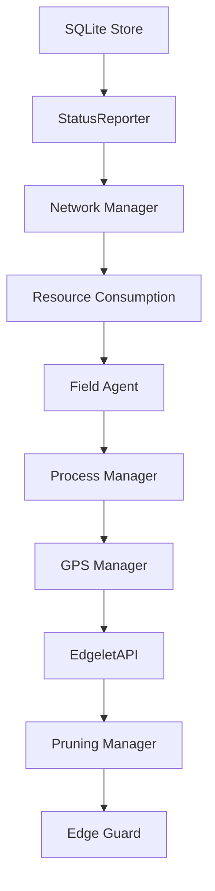

# Edgelet runtime modules

Deep-dive documentation for daemon components under `internal/`. For system overview and diagrams, see [../architecture.md](../architecture.md).

## Module startup order

The **Supervisor** opens SQLite, then starts modules in dependency order. Embedded containerd (when `containerEngine=edgelet`) must be running before Supervisor starts; bootstrap owns that in `cmd/edgelet`.

Approximate sequence in `internal/supervisor/supervisor.go`:

1. Open `store` (`/var/lib/edgelet/edgelet.db`)
2. `statusreporter` — aggregates module and daemon status for Controller POST
3. `network` — host interface management
4. `resourceconsumption` — host resource sampling
5. `fieldagent` — Controller REST client and sync workers
6. `processmanager` — container reconcile (after engine wired)
7. `gps` — NMEA/device integration
8. `edgeletapi` — HTTPS + Unix `/v1/...`
9. `pruning` — scheduled/threshold image + unused-local-model prune (not persistent VOLUME data)
10. `edgeguard` — hardware attestation loop

Host hardware/USB inventory posting (formerly Resource Manager) is **removed**. Edge Guard stays.

Shutdown reverses the order; `store.Close()` runs last (WAL checkpoint).

Lazy or engine-bound components (not separate Supervisor `Start()` modules):

- `volumemount` — initialized on first use; driven by Field Agent sync
- `dnsresolver` — started with edgelet engine
- `healthcheck` — goroutine when `containerEngine=edgelet`
- `proxy` — updated from Controller change feed
- `runtimeapi` — library facade for EdgeletAPI handlers
- `serviceaccount` — reconciled from Process Manager / Field Agent
- `modelmanager` — model artifact reconcile (wired from Supervisor / EdgeletAPI)

## StatusReporter module indices

`GET /v1/system/status` exposes `modulesStatus[]` aligned with `internal/utils/constants.go`:

| Index | Module |
|-------|--------|
| 0 | Resource Consumption Manager |
| 1 | Process Manager |
| 2 | Status Reporter |
| 3 | EdgeletAPI |
| 4 | Field Agent |
| 5 | *(unused — former Resource Manager; indexes are not reshuffled)* |
| 6 | GPS Manager |

Edge Guard, Pruning, Volume Mount, and SSH Proxy are not in this fixed array; their health surfaces via logs and dedicated status objects.

## Module documentation

### Tier 1 — core runtime

| Module | Document |
|--------|----------|
| Supervisor | [supervisor.md](supervisor.md) |
| Field Agent | [fieldagent.md](fieldagent.md) |
| Process Manager | [processmanager.md](processmanager.md) |
| EdgeletAPI | [edgeletapi.md](edgeletapi.md) |
| SQLite Store | [store.md](store.md) |

### Tier 2 — security and identity

| Module | Document |
|--------|----------|
| Auth | [auth.md](auth.md) |
| Service Account | [serviceaccount.md](serviceaccount.md) |
| Edge Guard | [edgeguard.md](edgeguard.md) — operator guide: [../edgeguard.md](../edgeguard.md) |

### Tier 3 — runtime plumbing

| Module | Document |
|--------|----------|
| Container Engines | [engines.md](engines.md) — operator guide: [../container-engine.md](../container-engine.md) |
| DNS Resolver | [dnsresolver.md](dnsresolver.md) — operator guide: [../dns.md](../dns.md) |
| Healthcheck Runner | [healthcheck.md](healthcheck.md) |
| Pruning Manager | [pruning.md](pruning.md) |
| Volume Mount Manager | [volumemount.md](volumemount.md) |
| Runtime API Facade | [runtimeapi.md](runtimeapi.md) |

### Tier 4 — supporting

| Module | Document |
|--------|----------|
| Status Reporter | [statusreporter.md](statusreporter.md) |
| Resource Manager (removed) | [resourcemanager.md](resourcemanager.md) |
| Resource Consumption | [resourceconsumption.md](resourceconsumption.md) |
| Network Manager | [network.md](network.md) |
| GPS Manager | [gps.md](gps.md) |
| SSH Proxy Manager | [proxy.md](proxy.md) |
| ControlPlane (runtime) | [controlplane.md](controlplane.md) — operator guide: [../control-plane.md](../control-plane.md) |

## Related operator docs

| Topic | Document |
|-------|----------|
| EdgeletAPI usage | [../edgelet-api-v1.md](../edgelet-api-v1.md) |
| Controller sync / CP deploy | [../control-plane.md](../control-plane.md) |
| SQLite backup / wipe | [../persistence.md](../persistence.md) |
| Workload volumes | [../volumes.md](../volumes.md) |
| Container engines | [../container-engine.md](../container-engine.md) |
| DNS | [../dns.md](../dns.md) |
| Workload labels/env | [../workload-metadata.md](../workload-metadata.md) |
| Manifest YAML | [../manifest-reference.md](../manifest-reference.md) |
| Model artifacts | [../models.md](../models.md) |
| Crash / last-error inspect | [../troubleshooting.md](../troubleshooting.md#microservice-crash--restart-loop) |
