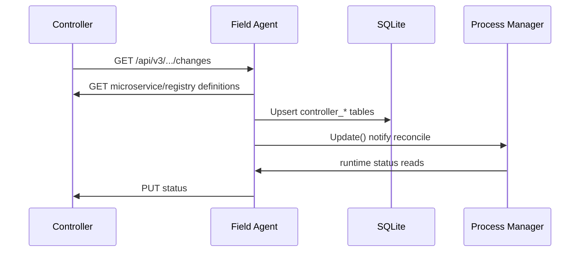

# Field Agent

The Field Agent is the **Controller client**. It polls the remote ioFog Controller over HTTPS (`/api/v3/...`), persists desired state to SQLite, drives Process Manager updates, posts aggregated status back to the controller, and handles provision/deprovision, OTA, exec/log WebSocket sessions, and service account token rotation.

**Code:** `internal/fieldagent/`

## Purpose

- Maintain connection and trust with the Controller (ping, certificate verification)
- Poll `config/changes` and apply microservice, registry, volume mount, model, and RuntimeClass deltas
- Hydrate agent credentials and Edge Guard signature from SQLite
- Notify Process Manager when desired microservice set changes
- POST status/diagnostics on a configurable interval
- Run release OTA when Controller signals `changeVersion`
- Bridge Controller-initiated exec and log streaming to EdgeletAPI WebSocket handlers

## Dependencies

| Depends on | Reason |
|------------|--------|
| `store` | Controller cache, credentials, Edge Guard JWT |
| `config` | `controllerUrl`, frequencies, agent UUID, keys |
| `auth` | JWT manager, EdgeletAPI token reconciliation |
| `processmanager` | `Update()` after microservice/registry changes |

| Used by | Reason |
|---------|--------|
| `supervisor` | Started before Process Manager; passed as microservice manager |
| `edgeletapi` / `runtimeapi` | Provision, deprovision, system status, exec/log paths |
| `healthcheck` | Edgelet-engine healthcheck coordination |

## Lifecycle

### Start

Entry: `(*FieldAgent).Start()` in `agent.go`.

1. Create `APIClient` and `Orchestrator` (Controller HTTPS)
2. Hydrate `private_key` from `agent_credentials` table; reset JWT manager if missing
3. If unprovisioned with `edgeGuardFrequency > 0`, force frequency to 0
4. If provisioned: load initial microservices, registries, volume mounts, models, and RuntimeClasses from Controller into SQLite; notify Process Manager
5. Start six background workers (see below)

### Stop

Cancel context; wait for worker goroutines (`wg.Wait()`).

### Config update

`Update()` on reload: re-hydrate private key, reset JWT, recreate API client asynchronously, optionally `postFogConfig()` if last reload succeeded.

## Background workers

| Worker | Config frequency | Role |
|--------|------------------|------|
| `pingControllerWorker` | `pingFrequency` | Controller connectivity; updates connection state |
| `runChangesWorker` | `changeFrequency` | `GET config/changes`; processes add/update/delete |
| `postStatusWorker` | `statusFrequency` | Aggregated status POST to Controller |
| `upgradeScanWorker` | `upgradeScanFrequency` | Release OTA when `changeVersion` changes |
| `localAPITokenRotationWorker` | internal | EdgeletAPI admin JWT rotation |
| `serviceAccountTokenRotationWorker` | internal | Projected SA token lifecycle |

Workers skip Controller calls when not provisioned or not connected.

## Controller API

All paths are relative to `{controllerUrl}/api/v3/...` (Pot-compatible). The `APIClient` wraps HTTP with agent JWT and TLS settings from config.

Typical flows:

Operator-facing ControlPlane deploy is documented in [../control-plane.md](../control-plane.md); reconcile still flows through Process Manager after SQLite rows exist.

## Configuration

| Key | Effect |
|-----|--------|
| `controllerUrl` | Controller base URL |
| `iofogUuid` | Empty when unprovisioned |
| `changeFrequency` | Changes poll interval (seconds) |
| `statusFrequency` | Status POST interval |
| `pingFrequency` | Connectivity probe interval |
| `upgradeScanFrequency` | OTA scan interval |
| `edgeGuardFrequency` | Forced 0 when unprovisioned |
| `privateKey` | In-memory; persisted in `agent_credentials` |

Provision/deprovision via EdgeletAPI mutates config and clears or sets credentials; see [../edgelet-api-v1.md](../edgelet-api-v1.md).

## Data and persistence

Field Agent is the primary writer for Controller-sourced rows:

| Table | Content |
|-------|---------|
| `controller_microservices` | Desired microservices from Controller |
| `controller_registries` | Registry credentials |
| `controller_volume_mounts` | Secrets/configmaps |
| `controller_models` | Fleet model snapshot |
| `controller_runtime_classes` | Fleet RuntimeClass snapshot (`name` + `handler`) |
| `agent_credentials` | Agent Ed25519 private key (singleton row) |
| `agent_edgeguard_signature` | Last attested Edge Guard JWT |

Local deploy tables (`local_workloads`, etc.) are written by EdgeletAPI/runtimeapi, not the changes worker.

## External APIs

| Surface | Role |
|---------|------|
| Controller REST | Poll, provision, status, diagnostics, OTA |
| EdgeletAPI (via runtimeapi) | `POST/DELETE /v1/system/provision`, exec/log WebSocket upgrade |
| Process Manager | `Update()` channel; implements microservice list for PM |

## Observability

- Log module name: `"Field Agent"`
- StatusReporter index: `4` (`utils.FieldAgent`)
- Controller connection state in system status (`controllerStatus`, verification flags)
- Structured debug codes: `FAPC`, `FACL`, `FAPS`, etc. in `internal/utils/constants.go`

## Failure modes

| Symptom | Typical cause |
|---------|----------------|
| No workloads start | Not provisioned; Controller unreachable |
| Repeated deprovision | Edge Guard hash mismatch (see [../edgeguard.md](../edgeguard.md)) |
| Deprovision during OTA/restart | Pre-v1.0.2 first-hit 401; upgrade Edgelet. v1.0.2+ defers until 5×401 over ≥60s (see [../troubleshooting.md](../troubleshooting.md#controller-status-401--unexpected-deprovision)) |
| Status not updating | `postStatusWorker` blocked; certificate errors; controller `/status` 503 (not ready — pair with Controller ≥ v3.8.2) |
| Exec/log failures | Active session map; WebSocket handler not registered |

## Code map

| File | Role |
|------|------|
| `agent.go` | Start/stop, provision hooks, callbacks |
| `workers.go` | Background polling loops |
| `changes.go` | Change list processing |
| `sync.go` | Initial and incremental sync helpers |
| `api_client.go` | Controller HTTP transport |
| `orchestrator.go` | Ping, certificate renewal |
| `exec_*.go`, `log_*.go` | WebSocket/exec session bridging |
| `provision_body.go` | Provision request handling |

Related: [processmanager.md](processmanager.md), [store.md](store.md), [edgeletapi.md](edgeletapi.md).
