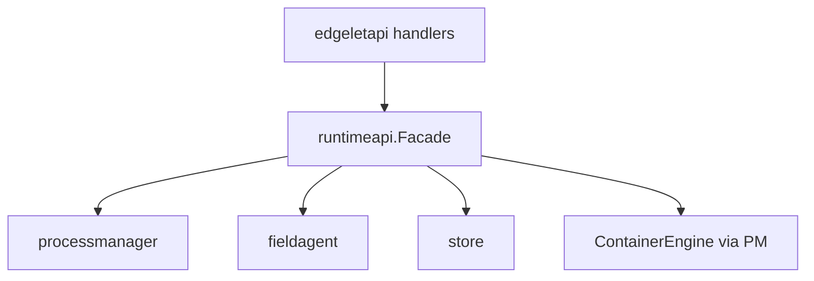

# Runtime API Facade

`runtimeapi` is the **domain layer** between EdgeletAPI HTTP handlers and runtime modules. Handlers stay thin; the `Facade` coordinates processmanager, fieldagent, store, config, pruning, and engine operations with consistent error types for stable API codes.

**Code:** `internal/runtimeapi/`

## Purpose

- Implement operator actions: provision, deploy apply, MS lifecycle, images, models, persistent volumes, prune, ControlPlane, RuntimeClass
- Translate domain errors → `Err*` types with HTTP/code mapping in handlers
- Keep container-engine and SQLite rules out of `internal/edgeletapi/handlers`
- Async operation tracking for long-running applies (ControlPlane, RuntimeClass)

## Dependencies

| Depends on | Reason |
|------------|--------|
| `processmanager` | Reconcile triggers, lifecycle, logs, exec |
| `fieldagent` | Provision/deprovision, managed MS view |
| `store` | Local deploy, registries, runtime classes, CP row |
| `config` | Validation, engine flavor gates |
| `pruning` | System/image prune |
| `buildmeta` | Version/flavor checks (RuntimeClass gating) |

| Used by | Reason |
|---------|--------|
| `edgeletapi/handlers` | All `/v1/...` mutation and list paths |

## Architecture

Entry: `runtimeapi.NewFacade()` — handlers hold a facade instance.

## Major facade areas

| Area | Files | Examples |
|------|-------|----------|
| Lifecycle | `facade.go` | `Provision`, `Deprovision`, `Prune` |
| Microservices | `facade.go` | `ListRuntimeMicroservices`, `Start/Stop/Restart`, logs |
| Local deploy | `facade.go`, `controlplane.go` | `UpsertLocalDeployment`, manifest apply |
| ControlPlane | `controlplane.go`, `controlplane_ms.go` | Async apply, env/port/volume mapping |
| RuntimeClass | `facade.go` | Staged apply/delete with operation IDs |
| Images | `facade.go` | Pull/load/remove/list |
| Volumes | `facade_volumes.go` | List/remove/prune persistent VOLUME claims |

## RuntimeClass operations

Staged pipeline constants:

- `write_config` → `stop_runtime` → `start_runtime` → `wait_cri_ready` → `verify_stability`
- Rollback/escalate paths on failure

Typed errors:

- `ErrRuntimeClassUnsupported` — not full flavor or not `edgelet` engine
- `ErrReservedRuntimeClassDelete` — e.g. `crun`
- `ErrRuntimeClassInUse` — blocking microservice UUIDs in details

Poll endpoints return terminal `failed` status in-band (HTTP 200).

## ControlPlane integration

`controlplane` package builds `models.Microservice` from manifest:

- Host ports 51121 / 80 → container API/viewer ports
- Named volumes for DB and logs (always **private** under `volumes/data/{uuid}/`; destroyed only on `controlplane delete`)
- Optional HTTPS cert bind mount

Process Manager reconciles `system_control_plane` row separately (see [processmanager.md](processmanager.md)).

Operator guide: [../control-plane.md](../control-plane.md).

## Configuration gates

- RuntimeClass: requires `buildmeta` full flavor + `containerEngine=edgelet`
- Local deploy: validates manifest `apiVersion` / `kind`
- Image pull: registry resolution from controller or local registries tables

## External APIs

All exposure is via EdgeletAPI — facade has no listeners.

Handlers map facade errors to:

- `INVALID_ARGUMENT`, `NOT_FOUND`, `CONFLICT`, etc. (see [../edgelet-api-v1.md](../edgelet-api-v1.md))

## Observability

- Log module: `"Runtime API Facade"`
- Deploy progress callbacks for async operations (stage + message)

## Failure modes

| Symptom | API code | Cause |
|---------|----------|-------|
| RuntimeClass 400 | `INVALID_ARGUMENT` | Desktop/lite build or docker engine |
| CP apply 409 | `CONFLICT` | Apply already in progress |
| Ambiguous MS selector | `INVALID_ARGUMENT` | Multiple matches for `namespace.name` |

## Code map

| File | Role |
|------|------|
| `facade.go` | Core facade methods, MS/image/deploy |
| `facade_volumes.go` | Persistent VOLUME list/remove/prune |
| `controlplane.go` | CP apply/status/delete |
| `controlplane_ms.go` | Manifest → microservice model, DNS FQDN helpers |

Related: [edgeletapi.md](edgeletapi.md), [processmanager.md](processmanager.md), [controlplane.md](controlplane.md), [../manifest-reference.md](../manifest-reference.md).
