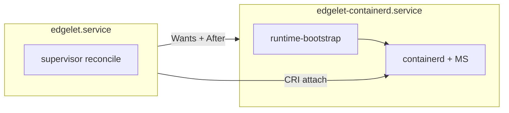

# Edgelet workload continuity (operator guide)

## Principle

Restarting **`edgelet`** (control plane) must **not** stop microservice containers unless you restart the **runtime** unit or perform a **cold engine change** (see [container-engine-lifecycle.md](container-engine-lifecycle.md)).

| Layer | systemd unit | Owns |
|-------|--------------|------|
| Data plane | `edgelet-containerd.service` | embedded containerd, CRI socket, MS containers |
| Control plane | `edgelet.service` | supervisor, field agent, Edgelet API, reconcile |

**docker / podman:** the host engine **is** the data plane — edgelet does not stop MS on control restart.

---

## docker / podman (leave-running)

Default **`shutdownPolicy=leave-running`** for external engines.

| Action | MS containers |
|--------|---------------|
| `systemctl restart edgelet` | **Keep running** — same container ID |
| `edgelet shutdown` (control stop) | **No drain** — reconcile reattaches on start |

Config (`/etc/edgelet/config.yaml`):

```yaml
shutdownPolicy: leave-running   # default for docker/podman
shutdownGracePeriodSeconds: 90  # used for optional maintenance / data-plane stops
pruningFrequency: 24            # hours between image prune cycles (engine-neutral key)
watchdogEnabled: true           # orphan container cleanup; also deletes local models and refuses local Model apply
```

Verify after control restart:

```bash
docker ps --filter label=iofog.org/microservice-uuid
edgelet system status -o json | jq '."runtime.agentPhase", ."runtime.shutdownPolicy"'
```

Reattach uses **labels + DB** — not Docker `RestartPolicy`.

---

## embedded engine (runtime split)

Production embedded installs use two units:

```bash
systemctl restart edgelet              # control only — MS survive
systemctl restart edgelet-containerd   # data plane — MS stop then reconcile
```

Cgroup bootstrap runs in `edgelet runtime-bootstrap` on the containerd unit. Control unit **attach-only** (`EDGELET_RUNTIME_SPLIT=1`).

**systemd coupling:** `edgelet-containerd.service` is **not** `PartOf=edgelet.service`. Stopping or restarting **only** `edgelet` leaves the data plane running.

**Data-plane stop (catalog runtimes included):** stopping or restarting `edgelet-containerd` drains labeled microservice containers first (`edgelet runtime drain`), then stops embedded containerd and reaps edgelet-managed shims. Total stop budget is **120 seconds** (default 90s drain + 30s reap/cleanup). If the control plane is briefly unavailable during stop, the data plane proceeds with degraded teardown rather than blocking indefinitely.

**Full embedded shutdown** (backup, uninstall, wipe):

```bash
sudo systemctl stop edgelet-containerd.service edgelet.service
```

### Unit dependency (systemd)



| Unit | `Wants` / `After` | Bootstrap |
|------|-------------------|-----------|
| `edgelet-containerd.service` | `network-online.target` | `edgelet runtime-bootstrap` |
| `edgelet.service` | `edgelet-containerd.service` | attach-only (no subtree mutation) |
| openrc `edgelet-containerd` | `before edgelet` | light `cgroup-preflight` in `start_pre` |

### Wrong-order manual restart (embedded split)

Restart the **data plane before the control plane** when both units need a restart:

```bash
# Wrong — bypasses After= ordering on manual restart:
systemctl restart edgelet && systemctl restart edgelet-containerd

# Correct:
systemctl restart edgelet-containerd.service
sleep 3
systemctl restart edgelet.service
```

Prefer **`stop` then `start`** on the data plane when upgrading shims or recovering from embed extract errors — see [container-engine.md](container-engine.md#data-plane-restart-and-shim-upgrades-embedded) and [troubleshooting.md](troubleshooting.md#embed-bundle--data-plane-restart).

### Data-plane crash loop (`file exists`)

Repeated `edgelet-containerd` restarts can fail with `rename extracted bundle: file exists` (fixed in current builds; recovery ladder in troubleshooting). While the data plane is down, the controller MS list may look **stale** — local `edgelet ms ls` reflects last-known DB state until CRI reattaches.

---

## Before runtime split (monolithic embedded)

Until **`edgelet-containerd.service`** is active with runtime split, a monolithic `systemctl restart edgelet` still **drains MS** (`shutdownPolicy=drain-all` default). Expect brief MS outage.

**Migration:** enable `edgelet-containerd`, install `edgelet.service.d/edgelet.conf` drop-in, restart data plane then control.

---

## Status during control restart

- Brief MS **UNKNOWN** on the controller dashboard is OK.
- Local status exposes **`runtime.agentPhase=restarting`** during control stop/start.
- Field-agent status POST **annotates** MS entries with `controlRestart: true` — posts are not suppressed.

---

## Cold engine change (unchanged)

Changing **`containerEngine`** still requires quiesce, MS cleanup, `pendingRestart`, service restart, and recreate from DB. Workload continuity does **not** relax this path.

---

## OTA restart matrix

| Bundle change | Restart |
|---------------|---------|
| Thin **edgelet** binary only | `systemctl restart edgelet` |
| Fat / containerd runtime bundle | `systemctl restart edgelet-containerd` then `edgelet` |

See [installation.md](installation.md) for hash-based OTA details.

---

## Integration tests

```bash
./test/workload-continuity/run-all.sh
./test/workload-continuity/run-all.sh --case=docker-restart
./test/workload-continuity/run-all.sh --case=embedded-restart
```

### Related regression suites

| Suite | Runner | VM |
|-------|--------|-----|
| workload-continuity | `test/workload-continuity/run-all.sh` | `edgelet-engine-lifecycle`, `iofog-test` |
| embedded (v2) | `test/embedded/run-all.sh` | `iofog-test` |
| embedded-cgroup-v1 | `test/embedded/run-all-cgroup-v1.sh` | `iofog-test-v1` (hybrid v1) |

Unified orchestrator: `./test/run-all.sh` (see [test/workload-continuity/README.md](../../test/workload-continuity/README.md)).
